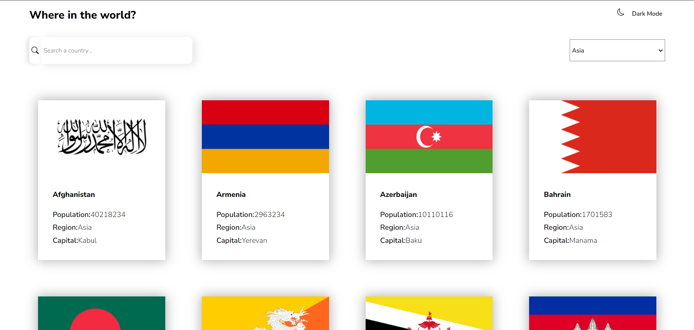
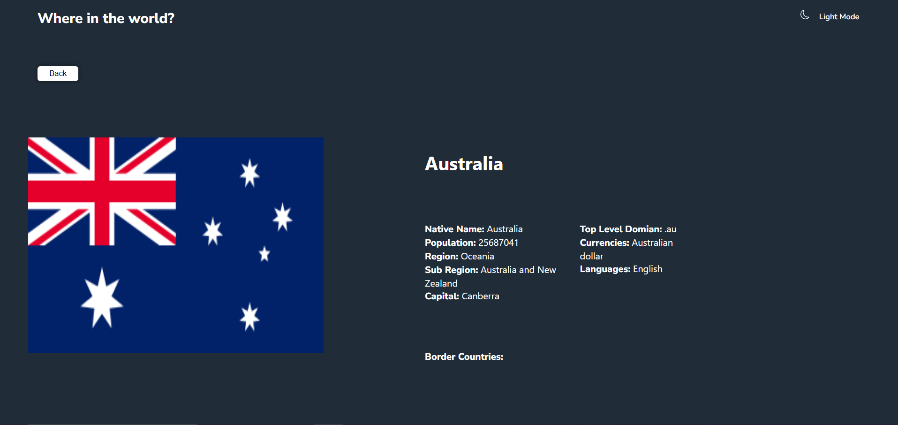

# Frontend Mentor - REST Countries API with color theme switcher solution


## Table of contents

- [Overview](#overview)
  - [The challenge](#the-challenge)
  - [Screenshot](#screenshot)
  - [Links](#links)
- [My process](#my-process)
  - [Built with](#built-with)
  - [What I learned](#what-i-learned)
  - [Continued development](#continued-development)
  - [Useful resources](#useful-resources)
- [Author](#author)
- [Acknowledgments](#acknowledgments)

**Note: Delete this note and update the table of contents based on what sections you keep.**

## Overview

### The challenge

Users should be able to:

- See all countries from the API on the homepage
- Search for a country using an `input` field
- Filter countries by region
- Click on a country to see more detailed information on a separate page
- Click through to the border countries on the detail page
- Toggle the color scheme between light and dark mode *(optional)*

### Screenshot

  Home Page -Dark Mode

  Home Page -Light Mode
  
    Details Page


### Links

- Solution URL: [Add solution URL here](https://your-solution-url.com)
- Live Site URL: [Add live site URL here](https://your-live-site-url.com)

## My process

### Built with

- Semantic HTML5 markup
- CSS custom properties
- Flexbox
- CSS Grid
- Mobile-first workflow
- [React](https://reactjs.org/) - JS library
- [Styled Components](https://styled-components.com/) - For styles

**Note: These are just examples. Delete this note and replace the list above with your own choices**

### What I learned

I have learned to manifest the power of props and was able to understand how the props can be passed over multiple different components in a hierarichle manner.
```html
<h1>Some HTML code I'm proud of</h1>
```
```css
.proud-of-this-css {
  color: papayawhip;
}
```
```js
const proudOfThisFunc = () => {
  console.log('🎉')
}
```

If you want more help with writing markdown, we'd recommend checking out [The Markdown Guide](https://www.markdownguide.org/) to learn more.

**Note: Delete this note and the content within this section and replace with your own learnings.**

### Continued development

This project has made me understood the core concepts of react such as functional components,props and States. But in the future I wish to learn more about libraries of react like Redux and also context.

### Useful resources

- [Example resource 1](https://www.geeksforgeeks.org/deployment-of-react-application-using-github-pages/) - This helped me to deploy the website. I really liked this pattern and will use it going forward.
- [Example resource 2](Googlefonts) - This website has always given me good fonts to work.


## Author

- Website - Divyansh Sao
- Frontend Mentor - @divs4799(https://www.frontendmentor.io/profile/divs4799)
- Instagram - [@yourusername](https://www.twitter.com/yourusername)


